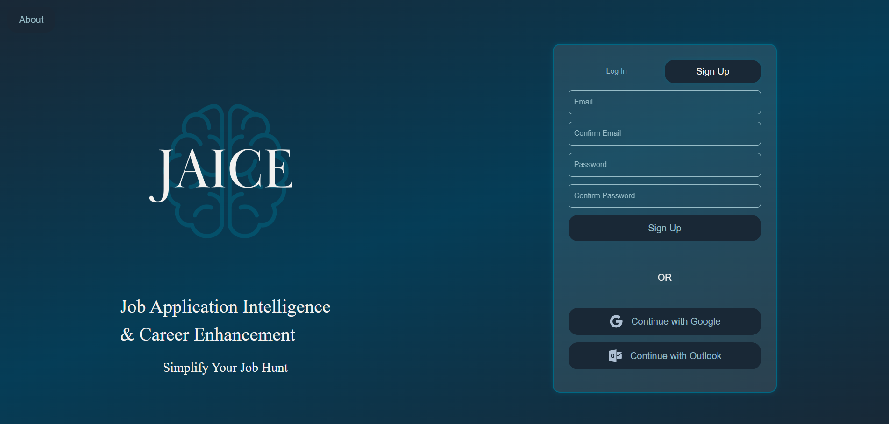
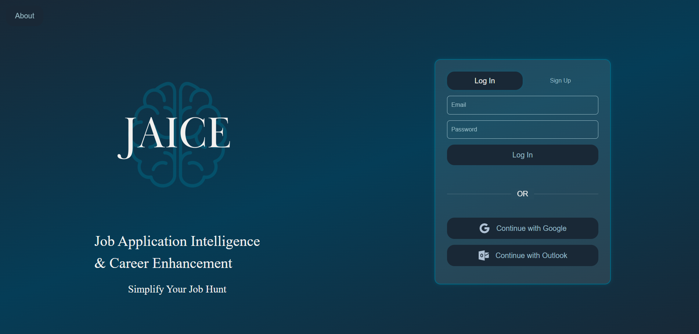
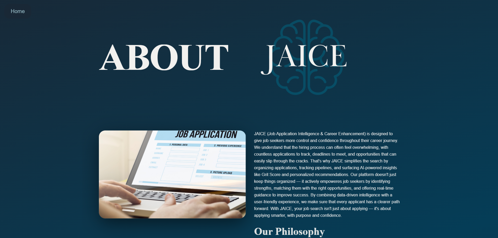
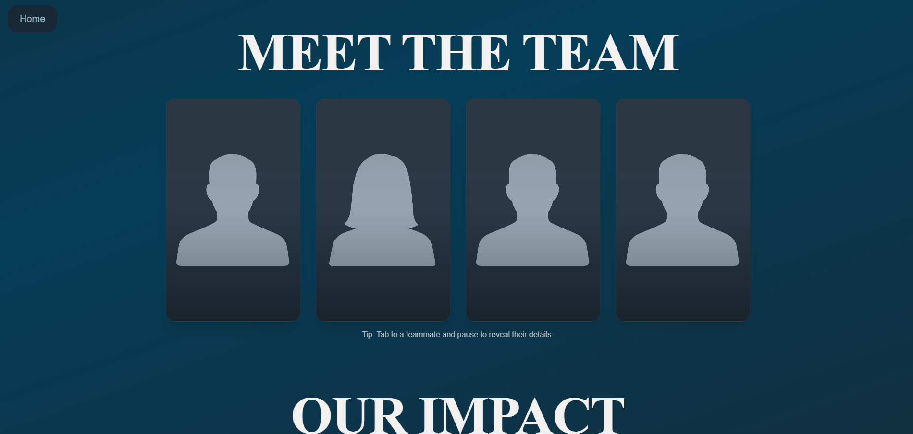

# JAICE — Job Application Intelligence & Career Enhancement
A clean, focused web application that helps job seekers track applications, stay organized, and get AI-powered insights to move faster and smarter.

> **Current Stage:** **Beta** - model integration and analytics groundwork in prep for user testing.

## Table of Contents
- [Introduction](#introduction)
- [This Month's Focus (Nov 2025)](#this-months-focus)
- [Features](#features)
- [Technologies](#technologies)  
- [Installation](#installation)
- [Development Setup](#development-setup)
- [Project Structure](#project-structure)
- [Screenshots](#screenshots)
- [License](#license)
- [Contributors](#contributors)
- [Project Status](#project-status)
- [Support](#support)
- [Paths](#paths)
- [Known Issues](#known-issues)
- [Roadmap](#roadmap)

## Introduction
JAICE (Job Application Intelligence & Career Enhancement) centralizes your job hunt. Track every application in one place, see what's next at a glance, and (soon) get AI-backed suggestions to improve your odds. 

## This Month's Focus
### This Month: **Beta Features**
The goal for this month is to be ready for **User Testing** next month. Our team has a main focus on the followning this month:
#### - **Model Integration** - 3 stage process
> 1. **Stage 0: Job-Related Binary Classifier**
>> - Goal: Decide if an email is job-related(`true`/`false`).
> 2. **Stage 1: Category Classifier**
>> - Goal: Map job-related emails into pipeline categories (e.g., `Applied`, `Interview`, `Offer`, or `Decision`)
> 3. **Stage 2: NER (Named Entity Recognition)**
>> - Goal: Extract `company`, `role`, `location`, `recruiter_name`, `email`, `phone`
#### - **Analytics & Dashboard**
> - Add **event tracking** on core actions (create/update application, stage change, email-ingest, inteview)
> - Populate **Dashboard v1**: totals by status, 7-Day activity, conversion to interview, and top sources.
> - Create a lightweight **Analytics REST service** to aggregate and serve user metrics.

## Features
- **Smart Application Sorting** — Stage your apps (Applied → Interview → Offer, etc.) and keep momentum.
- **SI-Powered Matching (planned)** — Compare resume vs job post; highlight gaps & suggestions.
- **Personalized Insights (planned)** — Recommendations using skills, experience, and market data.
- **Grit Score(planned)** — A momentum metric to visualize consistency and progress.
- **Notifications** — Fine-grained alerts for interviews, follow-ups, and deadlines.
- **Accessibility First** — Toggles and sensible defaults; designed for clarity and speed. 

## Technologies
### Frontend
- [React + Typescript](https://create-react-app.dev/docs/getting-started)
- [Vite](https://vite.dev/guide/)
- [Tailwind CSS](https://tailwindcss.com/docs/installation/using-vite)

### Backend
- [FastAPI(Python)](https://fastapi.tiangolo.com/)
- [PostgreSQL](https://www.postgresql.org/docs/)
- **Natural Language Processing (NLP)**: [spaCy](https://spacy.io/api/doc) / [scikit-learn](https://scikit-learn.org/stable/) / [Hugging Face Transformers](https://huggingface.co/docs/transformers/en/index)

Tooling: [ESLint](https://eslint.org/docs/latest/), GitHub + [Gitflow](https://www.atlassian.com/git/tutorials/comparing-workflows/gitflow-workflow)

## Installation
Open the terminal and run:   

```
# 1. Clone
git clone https://github.com/SephenSmothers/JAICE_Project.git jaice
cd jaice
```
```
# 2. Install dependencies
npm install
```
```
# 3. Run the local dev server
npm run dev
# Local: http://localhost:5173/
```
```
# 4. Run the production ready builds
npm run build
```
```
# Deployment testing
npm run preview
```

The project has been set up with tailwindcss added.

## Development Setup
- **Branching**: Gitflow
>- `main` = release, `development` = integration
- **Commits/Peer Reviews**: small, descriptive commits; Peer Reviews (PRs) require review before merge.
- **Code style**: ESLint
- **Env**: Frontend currently runs without secrets. When API is added, create `.env` with:
```
VITE_API_BASE_URL=http://localhost:8000
```

## Project Structure
*Reflects current repo layout (Beta development in progress)*

<details>
    <summary>Click to expand the full project tree</summary>

```text
JAICE_PROJECT/
├─ .vscode/
│  └─ tasks.json
├─ client/                                      # Frontend (React + Typescript + Vite)
│  ├─ app/
│  │  ├─ main.tsx
│  │  └─ layouts/
│  │     ├─ NavigationBar.tsx
│  │     └─ navigation.meta.tsx
│  ├─ assets/
│  │  ├─ fonts/
│  │  └─ icons/
│  ├─ global-components/                        # Shared React components
│  │  ├─ AuthProvider.tsx
│  │  ├─ Button.tsx
│  │  ├─ CheckBoxToggle.tsx
│  │  ├─ DropDownMenu.tsx
│  │  ├─ FloatingInputField.tsx
│  │  ├─ InfoModal.tsx
│  │  ├─ PlaceHolderText.tsx
│  │  ├─ SearchBar.tsx
│  │  └─ SlidingToggle.tsx
│  ├─ global-services/                          # Shared client-side services
│  │  ├─ api.ts
│  │  ├─ auth.ts
│  │  ├─ firebase.ts
│  │  ├─ input-validation.ts
│  │  ├─ readEmails.ts
│  │  └─ router.ts
│  ├─ global-style/
│  │  └─ Global.css
│  ├─ pages/                                    # Frontend routes & content
│  │  ├─ about/
│  │  │  ├─ AboutPage.tsx
│  │  │  ├─ about.meta.tsx
│  │  ├─ auth-about/
│  │  │  ├─ AuthAboutPage.tsx
│  │  │  └─ authabout.meta.tsx
│  │  ├─ dashboard/
│  │  │  ├─ DashboardPage.tsx
│  │  │  ├─ DashboardStageCards.tsx
│  │  │  └─ dashboard.meta.tsx
│  │  ├─ home/
│  │  │  ├─ HomePage.tsx
│  │  │  ├─ HomePage.md
│  │  │  ├─ MockJobCards.json
│  │  │  ├─ home.meta.tsx
│  │  │  └─ home-components/
│  │  │     ├─ AlertBox.tsx
│  │  │     ├─ Column.tsx
│  │  │     ├─ ControlBar.tsx
│  │  │     └─ JobCards.tsx
│  │  ├─ landing/
│  │  │  ├─ LandingPage.tsx
│  │  │  ├─ landing.api.ts
│  │  │  ├─ landing.meta.tsx
│  │  │  └─ landing-components/
│  │  │     ├─ LandingForm.tsx
│  │  │     ├─ Login.tsx
│  │  │     ├─ QuickSignIn.tsx
│  │  │     └─ SignUp.tsx
│  │  ├─ settings/
│  │  │  ├─ accessibility/
│  │  │  │  ├─ AccessibilityPage.tsx
│  │  │  │  └─ accessibility.meta.tsx
│  │  │  ├─ account/
│  │  │  │  ├─ AccountPage.tsx
│  │  │  │  └─ account.meta.tsx
│  │  │  └─ notifications/
│  │  │     ├─ NotificationPage.tsx
│  │  │     └─ notification.meta.tsx
│  └─ Dockerfile.client
├─ client_api/                                  # Backend (FastAPI Services)
│  ├─ api/
│  │  ├─ __init__.py
│  │  ├─ auth_api.py
│  │  └─ jobs.py
│  ├─ deps/
│  │  ├─ __init__.py
│  │  └─ auth.py
│  ├─ services/
│  │  ├─ __init__.py
│  │  ├─ firebase_admin.py
│  │  └─ supabase_client.py
│  ├─ utils/
│  │  └─ task_definitions.py
│  ├─ Dockerfile.client_api
│  ├─ client_secrets.json
│  ├─ main.py
│  └─ req.txt
├─ common/                                      # Shared utilities for logging, security, setup
│  ├─ __init__.py
│  ├─ logger.py
│  ├─ security.py
│  └─ setup.py
├─ shared_worker_library/                       # Worker & queue processing for model tasks
│  ├─ db_queries/
│  │  ├─ __init__.py
│  │  ├─ classification_queries.py
│  │  ├─ gmail_queries.py
│  │  ├─ ner_queries.py
│  │  ├─ relevance_queries.py
│  │  └─ std_queries.py
│  ├─ tasks/
│  │  ├─ __init__.py
│  │  ├─ classification_tasks.py
│  │  ├─ gmail_tasks.py
│  │  ├─ ner_tasks.py
│  │  ├─ relevance_tasks.py
│  ├─ utils/
│  │  ├─ __init__.py
│  │  ├─ task_definitions.py
│  │  └─ to_bytes.py
│  ├─ worker/
│  │  ├─ classification_worker.py
│  │  ├─ gmail_worker.py
│  │  ├─ ner_worker.py
│  │  ├─ relevance_worker.py
│  ├─ __init__.py
│  ├─ celery_app.py
│  ├─ database.py
│  ├─ Dockerfile.worker
│  ├─ req.txt
│  └─ setup.py
├─ public/
│  ├─ screenshots/
│  │  ├─ about-header.png
│  │  ├─ about-meet-the-team.png
│  │  ├─ about-our-impact.png
│  │  ├─ landing-login.png
│  │  └─ landing-signup.png
│  ├─ impact.png
│  ├─ JAICE_logo_inverted.png
│  ├─ JAICE_logo.png
│  ├─ job-application.png
│  ├─ user1.png
│  └─ user2.png
├─ src/
│  └─ server/
│     └─ utils/
│        └─ security.py
├─ .env 
├─ .gitattributes
├─ .gitignore
├─ docker-compose.yml
├─ eslint.config.js
├─ index.html
├─ package-lock.json
├─ package.json
├─ README.md
├─ tsconfig.app.json
├─ tsconfig.json
├─ tsconfig.node.json
└─ vite.config.ts
```
</details>

## Screenshots
- Landing Page


- About Page




## License
*UPDATES TBD*

## Contributors
|**Name**       |**Role**   |**GitHub**                                       |  
|---------------|-----------|-------------------------------------------------|  
|Antonio Lee Jr | Developer | [Techdudetony](https://github.com/Techdudetony) |
|Maya Henderson | Developer | [Catkus12](https://github.com/catkus12)     |
|Dontai Wilson  | Developer | [djwilson7](https://github.com/djwilson7) |
|Sephen Smothers| Developer | [SephenSmothers](https://github.com/SephenSmothers) |

## Project Status
**Beta development** on `development`. Backend + AI features are underway.

## Support
- Open an issue in Github with reproduction steps and screenshots.

## Paths
- **UI work**: `src/pages`, `src/components/Global`, `src/styles/Global.css`
- **Assets**: `public/`, `src/assets`

## Known Issues
*UPDATES TBD*

## Roadmap
- ✅ Application board (CRUD, stages)
- ✅ Auth (Sign up / Login)
- ⬜ Notifications (email/in-app)
- ⬜ Resume & Job post parsing (NLP)
- ⬜ Grit Score metric v1
- ⬜ Analytics dashboard
- ⬜ Import/Export (CSV)
- ⬜ Calendar integration (interviews)
- ⬜ Recruiter information extraction

